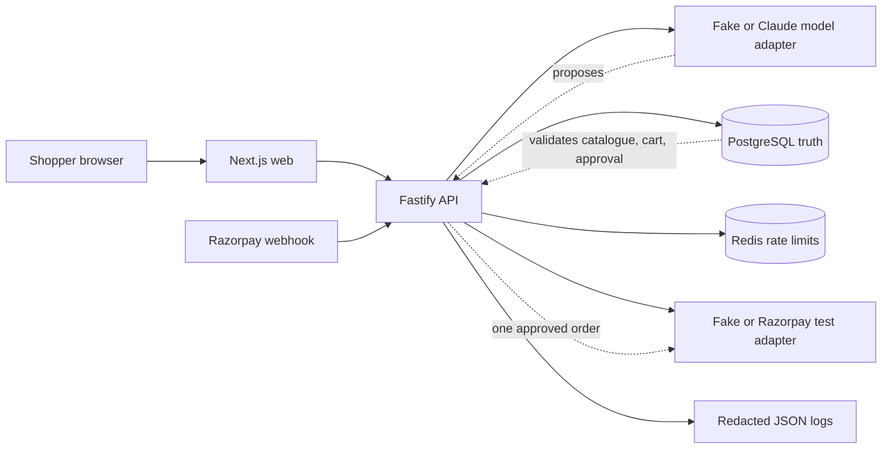

# ShopPilot

ShopPilot is a safe agentic-commerce demo for Razorpay Buildathon Track 1. A
shopper can ask for something such as “running shoes under ₹4,000,” answer only
the missing questions, compare grounded recommendations, approve an optional
add-on, and complete a Razorpay test-mode purchase.

The merchant exposes a machine-readable catalogue so the agent works from
current product, variant, stock, price, and policy data instead of inventing
details. Every money-related action is deterministic, bounded, explicitly
approved, and recorded.

## MVP promise

- One fictional shoe merchant with a polished storefront and 30–50 realistic
  products.
- Machine-readable discovery, catalogue search, and product lookup endpoints.
- Product pages containing Schema.org `Product`/`Offer` JSON-LD.
- Conversational shopping with minimal clarification.
- Three ranked, explainable, catalogue-grounded choices.
- One relevant, compatible, optional checkout add-on.
- A frozen order summary and explicit human approval before order creation.
- Razorpay Standard Checkout in test mode.
- Signed webhook processing, duplicate-event protection, and an audit timeline.
- A repeatable evaluation suite covering normal, ambiguous, malicious, and
  failure cases.

## Deliberate non-goals

- Crawling arbitrary websites or comparing multiple real merchants.
- Live payments, stored cards, or an agent entering payment credentials.
- Full compliance with ACP, AP2, UCP, or every ecommerce workflow.
- Training a model, voice shopping, returns, fulfilment, user accounts, or a
  merchant admin suite.
- Automatically adding an upsell or changing the approved cart.

## Stack

- TypeScript on Node.js 22+
- Next.js for the shopper and demo experience
- Fastify for the API and Razorpay webhook boundary
- Anthropic Messages API behind a Zod-validated Claude adapter
- PostgreSQL with Drizzle ORM
- Redis for readiness and bounded API rate limits
- A typed Razorpay HTTP adapter and Standard Checkout, test mode only
- Vitest, PostgreSQL/Redis integration tests, Playwright, and an offline
  evaluation runner
- pnpm workspaces, Docker Compose, GitHub Actions

The runtime model remains replaceable behind an internal interface.
Deterministic application code—not the model—owns prices, ranking constraints,
cart totals, authorization, order creation, and payment state.

## Repository map

```text
apps/web        Shopper UI and demo dashboard
apps/api        HTTP API, agent orchestration, checkout and webhooks
apps/worker     Dependency-readiness process; no background queue in this MVP
packages/domain Shared schemas, money types and state machines
packages/db     PostgreSQL schema and repositories
packages/testkit Fixtures, fake adapters and evaluation cases
packages/evals  Offline adversarial evaluation runner and scoring
eval/           Versioned cases and published evaluation artifacts
docs/           Product, architecture, delivery and submission truth
```

## Project documents

- [Product requirements](docs/PRODUCT.md)
- [Architecture and security](docs/ARCHITECTURE.md)
- [Delivery roadmap](docs/ROADMAP.md)
- [Testing and evaluation](docs/TESTING.md)
- [Research and decisions](docs/RESEARCH.md)
- [Submission plan](docs/SUBMISSION.md)
- [Current project state](docs/STATUS.md)

## Local setup

Prerequisites are Node.js 22 or newer, Corepack/pnpm, and Docker with the
Compose plugin. All local payment configuration is test mode only.

```bash
corepack enable
pnpm install
cp .env.example .env
docker compose up -d --wait
pnpm db:migrate
pnpm db:seed
pnpm build
```

Start the processes in separate terminals:

```bash
set -a && source .env && set +a
pnpm dev:api
pnpm dev:web
pnpm dev:worker
```

Open `http://localhost:3000` for the complete responsive shopper journey. The
“Happy path” preset reaches a verified fake-provider receipt without external
credentials. “Decline & recover” deliberately fails the first payment attempt,
then retries the same server-created order to demonstrate duplicate-safe
recovery. The safety trail identifies what the agent proposed, what
deterministic policy allowed, and what the shopper approved.

After Compose is healthy and the database is migrated and seeded, run
`pnpm demo:rehearse` for the release rehearsal. It drives the live API, web app,
PostgreSQL, Redis, and fake payment adapter through the declined-payment
recovery story on fresh desktop and mobile browser contexts. It also verifies
one provider order, the audit explanation, merchant evidence, machine-readable
discovery, and the 4:45 rehearsal ceiling.

`pnpm db:seed` is repeatable and installs the fictional `stepup-shoes`
catalogue: 36 shoes plus compatible accessories and inventory. It contains no
real shopper or merchant data. Re-running migration and seed commands is safe.

## Runtime architecture



The model proposes. PostgreSQL-backed deterministic policy validates and
authorizes. The shopper explicitly approves. Only then can the server create one
provider order. See [the detailed trust boundaries](docs/ARCHITECTURE.md).

Readiness endpoints:

- Web: `http://localhost:3000/api/health`
- API liveness: `http://localhost:3001/health/live`
- API dependency readiness: `http://localhost:3001/health`
- Worker: `pnpm --filter @shoppilot/worker start -- --health-check` after a
  build

Catalogue endpoints:

- Capability discovery: `GET http://localhost:3001/.well-known/ucp`
- OpenAPI 3.1 document: `GET http://localhost:3001/openapi.json`
- Search: `POST http://localhost:3001/v1/catalog/search`
- Product or slug lookup:
  `GET http://localhost:3001/v1/catalog/products/:idOrSlug`

Shopping conversation endpoints:

- Start: `POST http://localhost:3001/v1/conversations`
- Continue:
  `POST http://localhost:3001/v1/conversations/:conversationId/messages`

Cart and approval endpoints:

- Create/read: `POST /v1/carts`, `GET /v1/carts/:cartId`
- Select one primary variant: `POST /v1/carts/:cartId/lines`
- Accept, decline, or skip the one compatible offer:
  `POST /v1/carts/:cartId/addon-decision`
- Freeze and approve: `POST /v1/carts/:cartId/review`, then
  `POST /v1/carts/:cartId/approve`
- Run the checkout policy gate: `POST /v1/checkouts`
- Inspect redacted evidence: `GET /v1/carts/:cartId/audit`

Payment and merchant endpoints:

- Create one provider order: `POST /v1/payment-orders`
- Read reconciled state: `GET /v1/checkouts/:checkoutAttemptId`
- Verify Standard Checkout evidence: `POST /v1/payments/callback`
- Record cancellation: `POST /v1/payments/cancel`
- Receive raw signed evidence: `POST /v1/webhooks/razorpay`
- Fake-provider demo settlement (fake mode only):
  `POST /v1/demo/payments/settle`
- Read stored growth evidence: `GET /v1/merchants/:merchantId/growth`

The canonical request and response schemas are served from `GET /openapi.json`.
API responses include `x-request-id`; a safe caller value is preserved,
otherwise the server creates one. The same correlation ID is stored on agent-run
and commerce audit evidence. Conversation starts, turns, approvals, checkouts,
provider-order creation, and webhooks use separate Redis-backed fixed-window
limits. If that protection is unavailable, protected requests fail closed with
`503`.

Every cart mutation supplies `expectedVersion`; stale writers receive `409`
instead of silently overwriting a newer cart. Selecting a shoe creates at most
one in-stock add-on offer from the catalogue compatibility relation. The add-on
is inserted only when the decision body explicitly says `accepted`; reviewing an
unanswered offer records it as `skipped` without inserting it.

Review freezes SKU, variant, quantity, unit price, discount, tax, delivery, and
integer-paise totals in a database-immutable snapshot. Approval binds the
shopper ID, snapshot hash, total, and a short expiry. `POST /v1/checkouts`
revalidates approval freshness, cart version, budget, quantity, live price, and
stock before creating one unique internal checkout authorization.
`POST /v1/payment-orders` consumes only this allowed authorization boundary and
persists one fake or Razorpay test Order per checkout attempt. Repeating the
request returns the recorded state and never silently calls the provider again.

`PAYMENT_PROVIDER=fake` is the credential-free default. To use Razorpay test
mode, set `PAYMENT_PROVIDER=razorpay` together with all three server-only
`RAZORPAY_KEY_ID`, `RAZORPAY_KEY_SECRET`, and `RAZORPAY_WEBHOOK_SECRET` values.
The key ID must start with `rzp_test_`; live keys are rejected. Open
`http://localhost:3000/checkout/<checkout-attempt-id>` after authorization to
launch Standard Checkout. The browser receives the public key ID, provider order
ID, integer-paise amount, and currency, but never either secret. Checkout API
requests use the web app's same-origin `/v1` proxy; `API_BASE_URL` configures
its server-side destination and defaults to the local API on port 3001.

The callback endpoint verifies `order_id|payment_id` server-side, then fetches
that payment from Razorpay and checks its provider order, amount, currency, and
captured status before showing the verified receipt. Pending pages repeat that
server-side reconciliation, so localhost demos do not depend on an inbound
webhook for immediate success UX. The webhook remains the asynchronous source of
truth: it verifies the HMAC over the exact raw request bytes, deduplicates by
`x-razorpay-event-id`, and preserves `paid` when older evidence arrives later.
Provider calls left in an uncertain `creating` state time out to `expired` and
remain single-shot rather than risking a duplicate order.

Open `http://localhost:3000/merchant` for the compact merchant evidence view.
Its funnel, add-on outcomes, paid base/add-on values, average order value, and
attach rate come from PostgreSQL carts, immutable snapshots, payment records,
and append-only events. The fixed no-add-on comparison is explicitly labeled as
a historical-cart simulation; it reports a descriptive difference and makes no
conversion-lift, causal, or production-revenue claim. Metric definitions and the
compatibility reason for every recent suggestion are visible in the view.

The default `MODEL_PROVIDER=fake` mode is deterministic and needs no API key.
Set `MODEL_PROVIDER=anthropic`, `ANTHROPIC_API_KEY`, and optionally
`ANTHROPIC_MODEL` to use the server-side Claude Messages adapter. The default
model is `claude-haiku-4-5-20251001`. Responses use JSON-schema structured
output and are validated again with Zod; no browser receives the key. For
example, start the required-size flow with:

```bash
curl --request POST http://localhost:3001/v1/conversations \
  --header 'content-type: application/json' \
  --data '{"message":"Running shoes under ₹4,000"}'
```

Send `{"message":"UK size 8"}` to the returned conversation’s continuation
endpoint. ShopPilot then returns no more than three in-stock database products,
each with its exact variant, integer-paise price, fit explanation, trade-off,
and matched constraints. Conversation intent, messages, agent runs, tool calls,
and question-policy decisions are persisted in PostgreSQL.

For example, this returns in-stock running-shoe variants in UK size 8 at or
below ₹4,000. Money is always sent as integer paise:

```bash
curl --request POST http://localhost:3001/v1/catalog/search \
  --header 'content-type: application/json' \
  --data '{"maxPricePaise":400000,"sizeUk":8,"productType":"running"}'
```

The discovery format is a small ShopPilot protocol inspired by UCP catalogue and
capability concepts. It deliberately reports `ucpConformance: false`; this
project does not claim UCP conformance. Product pages such as
`http://localhost:3000/products/aero-pace` embed Schema.org `Product` and
`Offer` JSON-LD sourced from the same PostgreSQL catalogue.

Run the quality suite with `pnpm quality`. It checks repository hygiene,
formatting, lint, strict types, offline unit tests, PostgreSQL/Redis
integration, desktop/mobile Playwright journeys, the adversarial evaluation, and
production builds. Stop local infrastructure with `docker compose down`; named
volumes preserve data unless explicitly removed.

Run `pnpm security:check` for the production dependency audit and reviewed
license allow-list. Run `pnpm container:check` for resolved Compose validation
and static checks against privileged mode, host networking, unpinned `latest`
images, or missing health checks. GitHub Actions also runs Gitleaks across Git
history.

Run `pnpm eval` for the offline adversarial evaluation. It validates 50
versioned JSONL cases, compares ShopPilot with the fixed-keyword baseline,
enforces the release thresholds, and rewrites
[`eval/results/latest.json`](eval/results/latest.json) and
[`eval/SUMMARY.md`](eval/SUMMARY.md). No model key or payment account is used.

Copying `.env.example` is safe because it contains only local development values
and blank credential slots. Never commit `.env`, real model keys, or Razorpay
credentials. Razorpay key IDs are rejected unless they use the `rzp_test_`
prefix. If a default database port is already occupied, change `POSTGRES_PORT`
or `REDIS_PORT` and the matching connection URL in `.env` before starting
Compose.

## Known limitations

- This is a production-shaped single-merchant MVP, not a deployed or
  production-certified payment system.
- Razorpay acceptance still requires the reviewer's own test credentials and a
  reachable webhook; CI uses the contract-equivalent fake adapter.
- The worker currently proves dependency readiness only. The MVP has no queued
  jobs, dead-letter queue, accounts, fulfilment, returns, or cross-merchant
  search.
- Redis rate limits are coordination safeguards, not commerce truth. A Redis
  restart can reset counters; PostgreSQL approval, idempotency, and payment
  constraints remain authoritative.
- Demo records are retained intentionally for audit/evaluation. There is no
  public deletion API; local development data can be discarded with
  `docker compose down --volumes`, which irreversibly removes local volumes.

## Current state

The accessible demo journey, guarded test-payment flow, operational hardening,
merchant evidence, adversarial evaluation harness, and submission rehearsal are
implemented. See [current project state](docs/STATUS.md) for exact release and
verification evidence.
