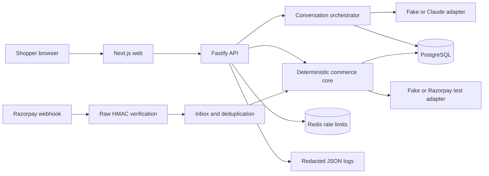

# Architecture and safety

## Design choice

Use a modular TypeScript monorepo with three deployable processes and shared domain packages. This keeps money and catalogue rules testable without a model or browser while preserving a clean production shape.



## Runtime modules

### `apps/web`

- Shopper conversation and recommendation UI
- Product comparison, optional add-on, cart review, and approval
- Razorpay Standard Checkout launcher
- Receipt, audit drawer, and demo/evaluation dashboard
- No secrets, model calls, price calculation, or authorization logic

### `apps/api`

- Fastify HTTP application and generated OpenAPI document
- Catalogue discovery/search/lookup
- Conversation and agent orchestration
- Cart, approval, policy, and checkout services
- Razorpay order creation, signature verification, and webhook endpoint
- Health/readiness and structured logging

### `apps/worker`

- Dependency-readiness process with structured startup evidence
- Reserved deployment boundary for future jobs; no queue is implemented in the
  narrow MVP
- No independent commerce rules

### `packages/domain`

- Zod schemas and TypeScript domain types
- Integer-paise money operations
- Shopping intent, ranking, compatibility, and question policy
- Cart, approval, order, and payment state machines
- Policy decisions and audit-event contracts
- Ports for model, payment, clock, ID, and event delivery

### `packages/db`

- Drizzle schema, migrations, transactions, indexes, and repositories
- PostgreSQL implementations of domain ports
- Seed data and reset tools

### `packages/testkit`

- Fake model and fake Razorpay adapters
- Fixed clock and deterministic ID generator
- Product factory, database helpers, webhook fixtures, and evaluation cases

### `packages/evals`

- Strict schema for versioned JSONL evaluation cases
- Frozen in-memory catalogue and deterministic evaluation model
- ShopPilot and fixed-keyword baseline runners using the same catalogue filters
- Threshold enforcement plus machine-readable and Markdown result publishing

## Why PostgreSQL and Redis

PostgreSQL is the source of truth for products, inventory, conversation state,
carts, approvals, external orders, webhook inbox entries, and audit events.
Frozen evaluation cases and results are versioned repository artifacts.
Transactions and uniqueness constraints protect payment boundaries.

Redis is not a source of truth. In the MVP it supports fixed-window API rate
limits and readiness checks. Correctness survives Redis eviction or restart
because durable state remains in PostgreSQL; a restart may only reset a rate
counter.

## Core data model

Implemented tables:

- `merchants`
- `catalog_versions`
- `products`
- `product_variants`
- `inventory`
- `product_relations`
- `conversations`
- `shopping_intents`
- `agent_runs`
- `carts`
- `cart_lines`
- `checkout_snapshots`
- `approvals`
- `policy_decisions`
- `checkout_attempts`
- `payment_orders`
- `payment_webhook_events`
- `audit_events`

Important constraints:

- Prices are integer paise with a currency column.
- SKU and variant identifiers are unique per merchant.
- Cart has a monotonically increasing version.
- Approval is unique and single-use for one cart snapshot hash.
- External order creation has a unique idempotency key.
- Razorpay order ID, payment ID, and webhook event ID are unique where present.
- Audit events are append-only at application permission level.

## State ownership

### Shopping intent

`collecting -> ready -> recommendations_shown -> product_selected -> cancelled`

### Cart

`draft -> review -> approved -> checkout_started -> terminal`

Any mutation after `approved` creates a new cart version and invalidates the previous approval.

### External order

`not_created -> creating -> created -> payment_pending -> paid | failed | expired | cancelled`

Only database-validated transitions are allowed. Webhook order is not assumed.

## Agent design

Use one shopping agent, not a multi-agent swarm. Its allowed tools are deliberately narrow:

- `searchCatalog(filters)` — read-only
- `getProduct(productId)` — read-only
- `selectProduct(productId, variantId)` — internal proposal only
- `proposeAddon(productId)` — internal proposal only
- `requestCartReview()` — freezes a draft but does not approve or pay

The model cannot call Razorpay. After explicit UI approval, application code invokes the policy gate and checkout service.

Model responsibilities:

- Extract a typed intent from natural language.
- Decide whether an essential clarification remains.
- Explain already-filtered recommendations in plain language.
- Explain a deterministic add-on suggestion.

Deterministic responsibilities:

- Validate intent and tool inputs.
- Filter and rank eligible products.
- Read prices, inventory, policies, and compatibility.
- Calculate totals and snapshot hashes.
- Authorize, create, and reconcile orders.
- Enforce rate, turn, tool, budget, and time limits.

## Catalogue discovery design

Implemented public endpoints:

```text
GET  /.well-known/ucp
GET  /openapi.json
POST /v1/catalog/search
GET  /v1/catalog/products/:id
POST /v1/carts
POST /v1/carts/:id/lines
POST /v1/carts/:id/review
POST /v1/carts/:id/approve
POST /v1/checkouts
POST /v1/payment-orders
GET  /v1/checkouts/:checkoutAttemptId
POST /v1/payments/callback
POST /v1/payments/cancel
POST /v1/webhooks/razorpay
GET  /v1/merchants/:merchantId/growth
```

The discovery endpoint declares only implemented capabilities and a project-specific protocol/version. Documentation will state that it is inspired by UCP capability discovery, catalog, cart, and checkout concepts. Product pages additionally emit Schema.org JSON-LD for broad machine readability.

## Payment boundary

1. Cart review creates an immutable snapshot from database values.
2. Shopper approval binds to that snapshot and expires quickly.
3. Checkout request opens a serializable database transaction or equivalent guarded transition.
4. Policy gate verifies the current snapshot, approval, total, stock, and prior execution.
5. An idempotency key derived from the approved snapshot identifies the attempt.
6. API creates a Razorpay Order server-side and persists the response.
7. Browser receives only public checkout configuration and the Razorpay order ID.
8. Callback evidence is signature-verified, then the server fetches the payment from Razorpay and reconciles provider order, amount, currency, and status. Pending receipt reads retry that provider check; signed webhooks remain the asynchronous fallback.
9. Duplicate and out-of-order webhooks enter an inbox table and produce safe no-op or forward-only transitions.

## Threat model

| Threat | Primary control | Evidence |
|---|---|---|
| Catalogue prompt injection | Descriptions are untrusted tool data; strict schemas; deterministic filters and policy | Adversarial evaluation cases |
| Hallucinated product/price | Canonical IDs and DB lookups at every boundary | Grounding score and integration tests |
| Over-budget purchase | Integer-paise calculation and policy rejection | Unit/evaluation tests |
| Add-on without consent | Explicit cart mutation endpoint and approval invalidation | E2E and audit event |
| Price/stock race | Immutable snapshot plus pre-order revalidation | Integration and demo failure |
| Duplicate order/action | Unique idempotency key and guarded state transition | Concurrency test |
| Forged callback/webhook | HMAC verification using raw body and server-side secret | Signature tests |
| Duplicate/out-of-order webhook | Unique event inbox and state-machine rules | Integration and video demo |
| Secret leakage | Server-only env validation, redaction, secret scan | CI and review |
| Runaway model loop/cost | Max turns, tool calls, wall time, and token budget | Agent-run tests and telemetry |
| Sensitive trace/log data | Redaction and disabled sensitive trace payloads | Logging tests |

## API and process reliability

- API connections, request receipt, database connections/statements, Anthropic
  calls, and Razorpay calls have explicit time-outs. The API request ceiling is
  longer than its bounded Claude call so first-use structured-schema compilation
  can complete or fail cleanly before the client connection closes.
  Provider-order ambiguity is expired without an automatic second call.
- Every response carries a validated/generated `x-request-id`. That correlation
  ID appears in structured API logs and is persisted on agent-run,
  conversation-event, and commerce audit evidence. The worker emits a process
  correlation ID; there are no job payloads in this MVP.
- Redis atomically rate-limits conversation starts/turns, approvals, checkout
  and provider-order requests, and webhooks in separate buckets. Protected
  operations fail closed when the limiter is unavailable.
- A transactional webhook inbox exists for the actual cross-process payment
  consistency boundary; no speculative outbox was added.
- Health checks distinguish liveness from dependency readiness.
- Graceful shutdown stops new work and lets active database operations settle
  within a ten-second bound.

## Database review

The catalogue filters use indexes on merchant/type and size/colour/price;
inventory and primary keys complete the joins. Cart and payment writes take row
locks inside transactions, while unique approval, snapshot, idempotency,
provider-order, payment-ID, and webhook-event keys resolve concurrent retries.
Session 9 adds lookup indexes for correlation evidence, webhook reconciliation,
and unused/uninvalidated approval expiry. Runtime pools bound connections,
connection waits, statements, and client-side queries.

Immutable snapshots and append-only audits intentionally have no application
deletion path. Conversation rows cascade only within a conversation aggregate.
For local disposable demo data, removing the Compose volumes is the documented
cleanup boundary; there is deliberately no partial cleanup that could leave
misleading payment or audit evidence.

## Privacy and retention

The MVP avoids accounts and minimizes personal data. Use fictional delivery data in demos. Do not store payment credentials or raw Razorpay secrets. Log identifiers and outcomes rather than full prompts or addresses. Provide development reset/cleanup commands and document retained tables.

## Architecture decisions

1. **One agent, deterministic commerce core.** Easier to inspect and safer than agent-to-agent choreography.
2. **Machine-readable API, not arbitrary crawling.** More reliable and directly demonstrates merchant transactability.
3. **Standards-inspired, not standards-certified.** Implement useful concepts without making a false conformance claim.
4. **Razorpay Standard Checkout, test only.** The agent prepares; the user controls credentials and payment confirmation.
5. **PostgreSQL is truth; Redis is coordination.** Payment correctness never depends on cache durability.
6. **Fake adapters are first-class.** CI and reviewers can run the full product without external accounts.
7. **Catalogue queries return eligible variants, not model-authored facts.** Search applies parameterized PostgreSQL filters before grouping products, uses stable product-ID cursors, and validates database rows and HTTP responses with shared Zod contracts. The v2 seed keeps 19 styles in each of five footwear categories so the bounded 20-product orchestration query can consider the complete matching category. HTTPS product-image URLs are canonical catalogue fields, and each seeded style has one photographed colour so variant labels cannot contradict the image. Colour is an optional preference: partial aliases such as `grey` match canonical shades such as `Cloud Grey`; when no shade matches, the orchestrator performs one audited search without colour while retaining use, size, budget, and stock constraints. After hard constraints are satisfied, broad result sets select stable low, middle, and high price quantiles instead of repeatedly returning the three cheapest rows.
8. **Conversation orchestration persists evidence but keeps authority deterministic.** PostgreSQL stores the typed intent and state on every turn plus append-only model-call, tool-call, and question-policy events. The model adapter can only return a strict intent patch and short explanations. A read-only catalogue tool, hard-filter recheck, stable price-spectrum selector, exact variant selector, and three-result cap run in application code. Refining an existing constraint continues the conversation; replacing the request starts a fresh conversation so omitted preferences do not leak forward. The fake adapter is the default local and test provider, so the complete conversation path requires no network or API key.
9. **Checkout authorization is separate from payment execution.** A cart uses a monotonically increasing content version and PostgreSQL row locks for optimistic concurrency. The compatibility relation, live inventory, and remaining shopper budget deterministically produce at most one affordable add-on offer; accepted, declined, and skipped outcomes are durable, and only explicit acceptance inserts the add-on line. Review stores a database-immutable canonical snapshot and SHA-256 hash. Approval binds that hash, user, total, currency, cart version, and expiry. The checkout policy transaction revalidates budget, quantities, stock, price, mutation state, freshness, and prior execution before producing one unique `authorized` checkout attempt. Payment adapters may consume that attempt; they cannot bypass it.
10. **Payment execution is single-shot and evidence-reconciled.** Fake and Razorpay test providers implement the same typed port. A PostgreSQL row lock and primary key claim the authorized attempt before the external call; retries return stored state, including an uncertain `creating` state, instead of creating another provider order. Standard Checkout receives public configuration only. Callback and exact-raw-body webhook signatures are verified server-side. After a valid callback, and while a payment remains pending, the server fetches the provider payment and matches its ID, order, integer-paise amount, currency, and captured status before transitioning to `paid`; this gives localhost an immediate verified result without weakening the webhook fallback. Cancelled, failed, and expired attempts are visibly terminal and route the shopper back to a fresh journey rather than reopening a consumed approval. Webhook event IDs are unique, and the explicit payment state machine ignores older evidence after `paid`. Every provider action and webhook outcome appends redacted audit evidence.
11. **Growth evidence is observational and reproducible.** The merchant reader calculates funnel counts from append-only events and order/add-on values from paid immutable snapshots using SQL. It also derives seven-day activity, up to 200 per-product performance records, category rollups, and conversion from those same persisted boundaries; catalogue stock and prices remain PostgreSQL facts. Insight cards are deterministic summaries of that evidence and use explicit empty states instead of inventing rankings before enough activity exists. Attach rate is paid orders with an explicitly accepted add-on divided by paid orders. The fixed comparison replays authorized historical carts and subtracts accepted add-on lines for its no-add-on scenario; both the API and UI label it non-causal and avoid unsupported conversion or revenue claims.
12. **Evaluation is frozen, offline, and failure-visible.** Versioned JSONL cases use a fixed catalogue fixture and strict Zod validation. The ShopPilot run exercises production conversation orchestration, catalogue filtering, tool schemas, and payment transitions with a deterministic evaluation model; the baseline uses fixed keyword extraction with the same deterministic commerce boundaries. The command publishes every case result and named failure, enforces release thresholds, and requires no model or payment account. New material boundary bugs must add a stable regression case to the current or next dataset version.
13. **The demo is one progressive, contract-driven journey.** The Next.js client uses the same shared Zod contracts as the API while moving through clarification, recommendation, exact-variant detail, explicit add-on choice, snapshot review, approval, checkout, and receipt. It calculates no commerce facts in the browser. A settlement endpoint is registered only when the fake payment provider is active; it produces signed fake webhook evidence so happy and declined-payment recovery presets exercise the real payment state machine without exposing a production shortcut. Playwright uses deterministic contract-shaped fixtures for fast failure-state coverage and also completes the happy path against the live Fastify, PostgreSQL, and fake-provider stack on desktop and mobile.
14. **Operational evidence is correlated and content-minimal.** The API accepts
    only a bounded safe request-ID syntax or generates a UUID, returns it to the
    caller, and propagates it through asynchronous PostgreSQL writes. JSON logs
    contain method, route template, status, duration, outcome, and identifiers,
    not request bodies, query strings, prompts, signatures, or addresses.
    Key-based and credential-shaped redaction is tested. Redis limits abuse at
    selected boundaries, while PostgreSQL remains the only authority for money
    safety.
15. **The machine-contract trace is an observable projection, not another
    agent.** The web client fetches and validates the merchant discovery
    profile from the public same-origin route, then maps the current typed
    recommendation, selected variant, versioned cart, immutable snapshot,
    approval, policy handoff, and payment order into a seven-stage trace. The
    checkout page carries a compact handoff through Razorpay navigation. This
    surface creates no cart or payment side effects, exposes no credentials or
    raw prompts, and cannot bypass the existing consent or policy boundaries.
16. **Autonomous buying is a separate machine client with one bounded
    delegation.** The `/ai-buyer` client calls the public discovery,
    conversation, product, cart, approval, checkout, payment-order, and audit
    contracts directly. It carries one caller-created correlation ID through
    every request, validates every response with shared Zod schemas, and marks
    an exchange complete only after a valid response. The client chooses the
    first deterministic eligible recommendation under the declared hard cap,
    applies the user's up-front add-on rule, and performs no intermediate human
    product or cart selection. It then reads PostgreSQL-backed append-only cart
    evidence before approval and again after provider-order creation, requiring
    the same correlation ID and a durable `provider_order_created` event. Exact
    frozen-total approval and Razorpay authentication remain human boundaries;
    this is bounded autonomous preparation, not authority to spend or enter
    payment credentials.
